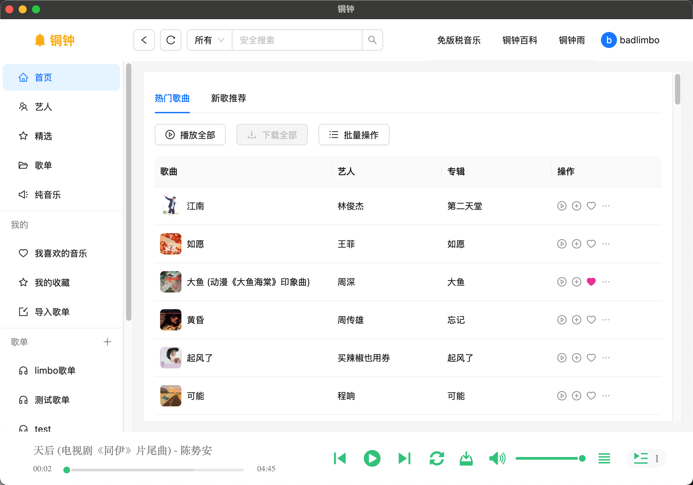
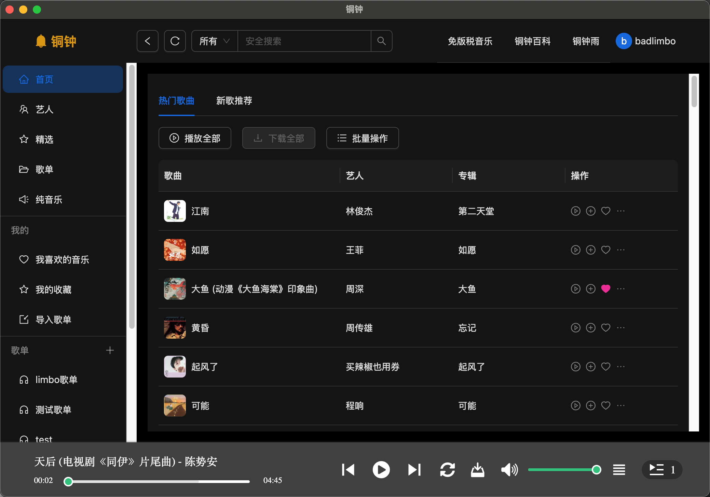

# Tonzhon-Desktop

[铜钟](https://tonzhon.whamon.com)客户端, 网页版请访问: https://tonzhon.whamon.com/

## 截图

<p align="center">
  
  
</p>

## 下载

你可以直接前往 [Releases](https://github.com/hacker0limbo/tonzhon-desktop/releases) 页面下载. 目前仅支持 MacOS 和 Windows.

由于 GitHub 国内下载较慢, 我把最新版本放在了网盘里, 需要的可以前往下载:

- [微云](https://share.weiyun.com/xOyTMdyW)

## 安装说明

由于是个人开发没有做安全认证, MacOS 可能会提示无法打开应用, 需要在系统偏好设置中允许打开.

## 开发

```bash
npm install
npm run start
```

如果安装失败, 请尝试使用国内镜像, 可参考官方文档的[镜像部分](https://www.electronjs.org/zh/docs/latest/tutorial/installation#%E9%95%9C%E5%83%8F)

在 `.npmrc` 文件中添加如下内容:

```bash
electron_mirror=https://npmmirror.com/mirrors/electron/
```

## TODO

- [ ] 歌单无法上传图片
- [ ] 取消收藏某歌单
- [ ] 删除自己创建的歌单
